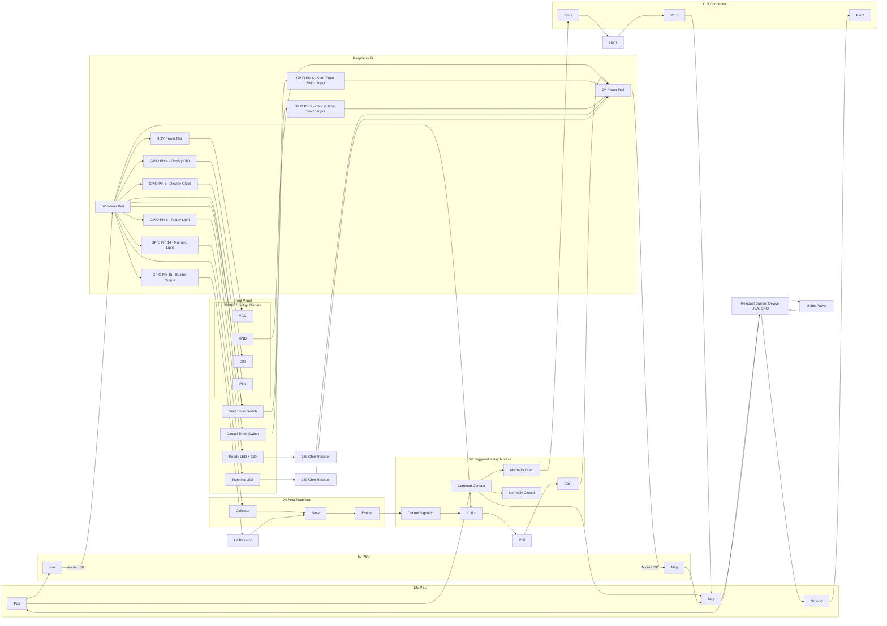

# Timer Hardware

This document contains the bill of materials for a small timer for freestyle competitons.

> This system uses electronics and mains power, damage to components or electrocution are possible if the system is assembled incorrectly, so the work should only be undertaken by suitably qualified and experienced people.

## Bill of Materials

For this stage of the project, we souced all the materials from [The Pi Hut](https://thepihut.com/)

- 240V to 12V 15A Power Supply
- 12V to 5V 2.5A power supply for raspberry PI
- 64GB SD Card loaded with [Raspberry Pi OS](https://www.raspberrypi.com/software/)
- [Raspberry Pi Zero 2 With Header](https://thepihut.com/products/raspberry-pi-zero-2?variant=43855634497731)
- 2 Non-locking switches Ideally waterproof and able to be mounted in a hole
- Car Horn (12V 10A)
- Two Electronics Project Boxes
- Male and Female XLR connectors (Ideally Waterproof)
- XLR Cable
- 330 Ohm and 1k Ohm resistors.
- LEDs
- 6 Digit TM1637 7 Segment Display
- 2N3904 Transistor
- Misc connecting wires and electrical connectors (spade crimps, WAGO, etc)

> Transistor example
> https://elinux.org/RPi_GPIO_Interface_Circuits#Using_an_NPN_transistor

# Connection Diagram

