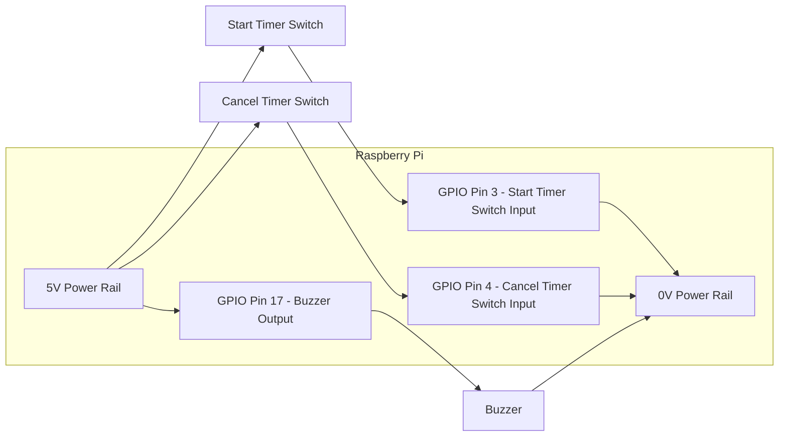

# Timer Hardware

This document contains the bill of materials for a small timer for freestyle competitons.

> This system uses electronics and mains power, damage to components or electrocution are possible if te system is assembled incorrectly, so the work should only be undertaken by suitably qualified and experienced people.

## Bill of Materials

For this stage of the project, we souced all the materials from [The Pi Hut](https://thepihut.com/)

- 5V power supply for raspberry PI
- 64GB SD Card loaded with [Raspberry Pi OS](https://www.raspberrypi.com/software/)
- [Raspberry Pi Zero 2 With Header](https://thepihut.com/products/raspberry-pi-zero-2?variant=43855634497731)
- [E-Ink Display pHAT - 2.13"](https://thepihut.com/products/eink-display-phat-2-13-250x122)
- 2 Non-locking switches (such as those in [Project Box 1 for Raspberry Pi](https://thepihut.com/products/project-box-1-for-raspberry-pi))
- Small Buzzer (such as those in [Project Box 1 for Raspberry Pi](https://thepihut.com/products/project-box-1-for-raspberry-pi))

# Connection Diagram

