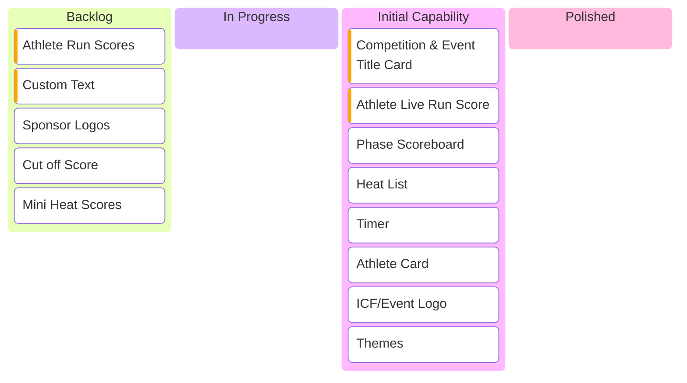

# Sports TV Broadcast Overlay Components

This document outlines the components required for a sports TV broadcast overlay. The components are categorized into two sections: backlog (to be implemented) and completed (already implemented).

## Kanban Board

## Features

### Modals

-   ~~**Phase Scoreboard**: Displays the current score of the Phase.~~
-   **Competition & Event Title Card**: Shows the title of the current Competition & Event
-   ~~**Heat List**: Shows athletes in a heat~~

### Lower Third Overlay

-   **Athlete Live Run Score**: Displays the current scored points for the run
-   ~~**Timer**: Shows the run countdown.~~
-   ~~**Athlete Card**: Displays player names, affiliation, bib.~~
-   **Athlete Run Scores**: Athlete Card Plus: individual run scores, final score, current ranking(?)
-   **Custom Text**: Overlay displaying custom text for delays etc.
-   **Cut off Score**: Show the score needed to make the "cut" to the next round.

### Upper Third Overlay

-   ~~**ICF/Event Logo**: Shows ICF and event Logo~~
-   **Sponsor Logo**: Shows the Sponsor Logo
-   **Mini Heat Scores**: For Showing scoring in the top left/right of the screen for finals.
