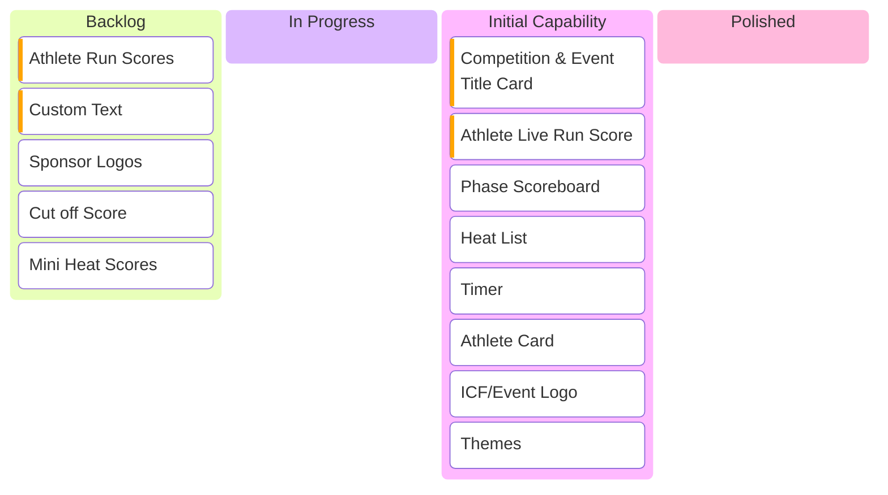

# Sports TV Broadcast Overlay Components

This document outlines the components required for a sports TV broadcast overlay. The components are categorized into two sections: backlog (to be implemented) and completed (already implemented).

## Kanban Board

```mermaid
kanban
    Backlog

        Athlete Run Scores @{priority: "High"}
        Custom Text @{priority: "High"}
        Sponsor Logos
        Cut off Score

        Mini Heat Scores

    In Progress


    Initial Capability
        Competition & Event Title Card @{priority: "High"}
        Athlete Live Run Score @{priority: "High"}
        Phase Scoreboard
        Heat List
        Timer
        Athlete Card
        ICF/Event Logo
        Themes
    Polished

```

## Animation Wrapper

### PixiFrameSequenceOverlay

A reusable wrapper that renders a PNG frame sequence as a GPU-accelerated background using Pixi.js and layers child React broadcast components above it.

**File**: `PixiFrameSequenceOverlay.tsx`

**Props**:

| Prop              | Type               | Required | Default    | Description                                                 |
| ----------------- | ------------------ | -------- | ---------- | ----------------------------------------------------------- |
| `basePath`        | `string`           | Yes      |            | Base path to the PNG frames directory                       |
| `frameCount`      | `number`           | Yes      |            | Total number of frames in the sequence                      |
| `holdImage`       | `number \| string` | Yes      |            | Zero-based frame index or filename suffix to pause on       |
| `isVisible`       | `boolean`          | Yes      |            | Drives intro (on true) and outro (on false)                 |
| `children`        | `ReactNode`        | No       |            | Broadcast overlay component to layer above the animation    |
| `fps`             | `number`           | No       | `30`       | Playback rate in frames per second                          |
| `fileNamePrefix`  | `string`           | No       | `"frame_"` | Prefix for each frame filename                              |
| `fileNamePadding` | `number`           | No       | `4`        | Zero-pad width for frame numbers (e.g. `4` → `0001`)        |
| `fileExtension`   | `string`           | No       | `"png"`    | File extension for frame images                             |
| `frameUrls`       | `string[]`         | No       |            | Override with explicit frame URL list (skips path building) |
| `onExitComplete`  | `() => void`       | No       |            | Callback fired when the outro sequence finishes             |

**Playback lifecycle**:

1. All frames are preloaded into GPU textures before playback starts.
2. When `isVisible` becomes `true`: plays frames `0 → holdImage` (intro).
3. Holds on `holdImage` frame while `isVisible` remains `true`.
4. When `isVisible` becomes `false`: plays frames `holdImage+1 → end` (outro).
5. `onExitComplete` is called and the canvas is hidden.

Frames are expected at `{basePath}/frame_{NNNN}.{ext}`. Pass `frameUrls` to supply a custom URL list (for future Nginx API integration). See `ADR006` for architectural rationale.

**Example**: `Cards/AthleteCardWithAnimation.tsx`

---

## Features

### Modals

-   ~~**Phase Scoreboard**: Displays the current score of the Phase.~~
-   **Competition & Event Title Card**: Shows the title of the current Competition & Event
-   ~~**Heat List**: Shows athletes in a heat~~

### Lower Third Overlay

-   **Athlete Live Run Score**: Displays the current scored points for the run
-   ~~**Timer**: Shows the run countdown.~~
-   ~~**Athlete Card**: Displays player names, affiliation, bib.~~
-   **Athlete Run Scores**: Athlete Card Plus: individual run scores, final score, current ranking(?)
-   **Custom Text**: Overlay displaying custom text for delays etc.
-   **Cut off Score**: Show the score needed to make the "cut" to the next round.

### Upper Third Overlay

-   ~~**ICF/Event Logo**: Shows ICF and event Logo~~
-   **Sponsor Logo**: Shows the Sponsor Logo
-   **Mini Heat Scores**: For Showing scoring in the top left/right of the screen for finals.
