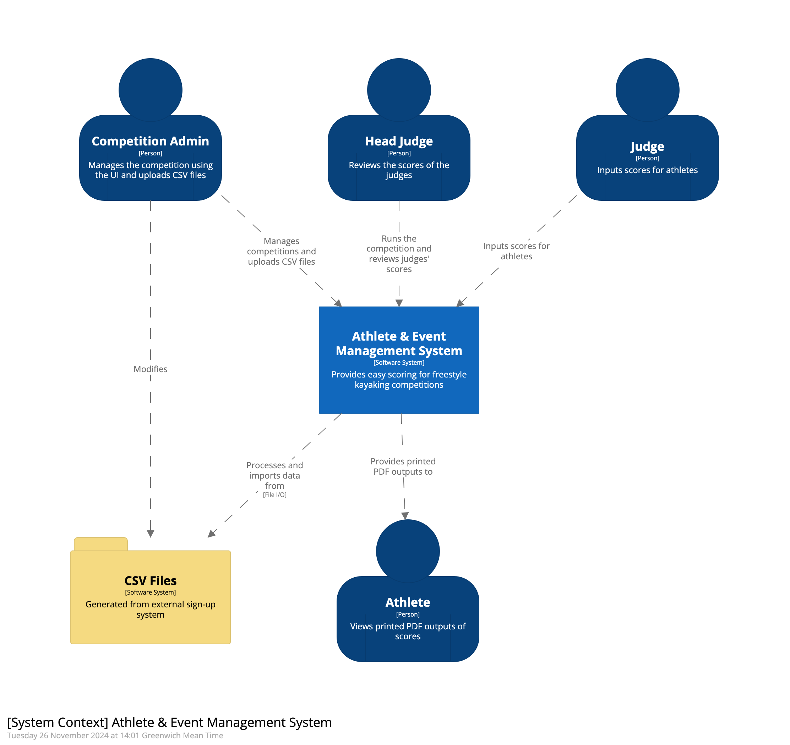
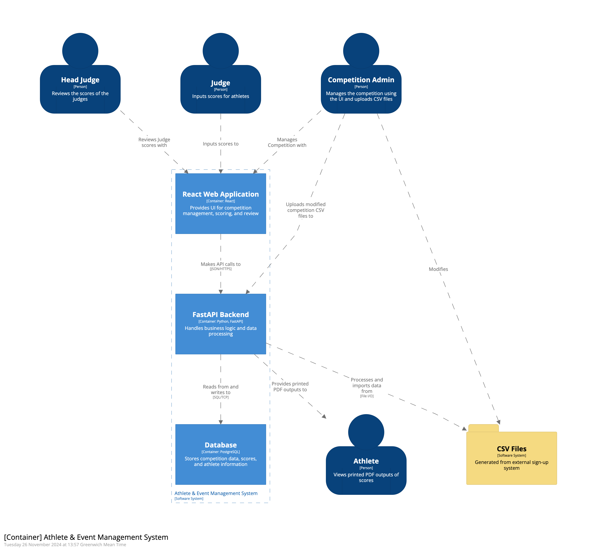

# Architecture Documentation (arc42)

## 1. Introduction and Goals

### System Purpose

AEMS (Athletic Event Management System) is a comprehensive competition management system designed to handle athletic events, with a particular focus on scoring, judging, and competition workflow management. The system supports multiple roles (judges, scribes, administrators) and manages complex competition structures including phases, heats, and individual runs.

### Quality Goals

1. **Reliability**: Ensure accurate scoring and competition data management
2. **Real-time Capability**: Provide immediate updates for competition progress
3. **Network Resilience**: Handle local network disconnections gracefully
4. **Usability**: Intuitive interfaces for different user roles
5. **Scalability**: Handle multiple concurrent users and competitions
6. **Flexibility**: Support different scoring systems and competition formats

### Stakeholders

- Competition Organizers
- Head Judges
- Judges/Scribes
- Athletes
- Technical Administrators
- Spectators/Audience

## 2. Architecture Constraints

### Technical Constraints

- Web-based application for cross-platform compatibility
- Modern browser support required
- Local network connectivity (no internet required)
- Docker containerization for deployment
- Touch-optimized interface for tablet devices

### Organizational Constraints

- Must support multiple concurrent competitions
- Role-based access control
- Audit trail for scoring changes
- Integration with ICF competition procedures
- Offline network operation for competition venues

## 3. System Scope and Context

### System Context Diagram

The system context diagram shows the key users and their interactions with AEMS:

- **Head Judge**: Manages competition setup, reviews scores, generates reports
- **Judge/Scribe**: Inputs scores for athletes using touch interface
- **Athlete**: Views results and receives PDF outputs
- **Display Devices**: Show real-time results to spectators
- **External Registration System**: Provides initial competition data via CSV

### Business Context

The system operates in the context of freestyle kayaking competitions, managing:

- Competition creation and configuration from CSV data
- Participant registration and heat management
- Real-time scoring with judge validation
- Score review and approval by Head Judge
- Results calculation and publication
- PDF generation for official documentation

### Technical Context

- Frontend: React/TypeScript application with touch optimization
- Backend: Python FastAPI server with WebSocket support
- Database: PostgreSQL (accessed via SQLAlchemy)
- Real-time updates via WebSocket with automatic reconnection
- PDF generation for competition documentation
- Docker containers for consistent deployment
- Offline network operation (no internet required)

## 4. Solution Strategy

The solution follows these key principles:

1. **Offline-First Architecture**: Operates on local networks without internet
2. **Real-time Synchronization**: WebSocket implementation with resilient reconnection
3. **Role-Based Design**: Components and interfaces tailored to user roles
4. **Touch-Optimized UI**: Designed for tablet and touchscreen devices
5. **Conflict Resolution**: Server-authoritative state with graceful conflict handling
6. **Modular Scoring System**: Flexible scoring logic for different competition types

## 5. Building Block View

### Level 1: System Overview

The container diagram shows the high-level technical components:

- **Web Application**: React/TypeScript frontend with real-time updates
- **API Server**: FastAPI backend with WebSocket support
- **Database**: PostgreSQL database with audit logging
- **Reverse Proxy**: Nginx for request routing and static file serving

### Level 2: Building Blocks

#### Web Application

- Competition Management Components
- Role-based Interfaces (Head Judge, Judge/Scribe)
- Real-time Scoring Interface with touch optimization
- WebSocket client with automatic reconnection
- PDF Generation Interface
- Offline data persistence and synchronization

#### API Server

- Competition Management Endpoints
- Scoring Logic Service with validation
- PDF Generation Service (Heat, Phase, Competition results)
- WebSocket Handler with heartbeat and reconnection
- Authentication and Role Management Service
- Conflict Resolution and State Synchronization

#### Database

- Competition Data and Structure
- Scoring Records with Audit Trail
- User Sessions and Role Assignments
- State Synchronization Metadata

## 6. Runtime View

### Competition Setup Scenario

1. Head Judge uploads competition data (CSV)
2. System validates and processes athlete data
3. Competition structure created in database
4. Heats and phases automatically generated
5. UI updates with new competition data across all devices

### Real-time Scoring Scenario

1. Judge accesses scoring interface on tablet
2. Real-time score input with touch-optimized controls
3. WebSocket broadcasts updates to all connected clients
4. Head Judge receives immediate notifications
5. Score validation and temporary storage
6. Head Judge reviews and locks in final scores
7. PDF generation available for results

### Network Disconnection Scenario

1. Device loses network connection during scoring
2. UI shows disconnected state with clear feedback
3. Scores queued locally in browser storage
4. WebSocket attempts automatic reconnection
5. Connection restored with exponential backoff
6. Local scores synchronized with server state
7. Conflicts resolved (server state wins)
8. UI updates with current competition state

## 7. Deployment View

### Infrastructure Level 1

Docker-based deployment optimized for competition venues:

- Frontend Container (React application)
- Backend Container (FastAPI server with WebSocket)
- Database Container (PostgreSQL with persistence)
- Nginx Container (Reverse proxy and static files)

### Network Topology

Offline network configuration:
- Dedicated WiFi router with WPA3 security
- Server laptop with static IP (192.168.0.28)
- Judge tablets connected via WiFi
- Optional display devices for spectators
- No internet connection required

### Infrastructure Level 2

Network Configuration:
- Internal Docker network for service communication
- Exposed ports for web access (80, 443)
- WebSocket connections on standard HTTP ports
- Database persistence via Docker volumes
- Network isolation for security

## 8. Cross-cutting Concepts

### Security

- Network isolation with offline operation
- Rate limiting and input validation
- Secure WebSocket connections
- SQL injection prevention
- XSS protection
- Role-based access control
- Audit logging for all score changes

### Network Resilience

- WebSocket reconnection with exponential backoff
- Local data persistence during disconnections
- Automatic state synchronization on reconnect
- Graceful degradation of real-time features
- Clear user feedback for connection status

### User Interface

- Touch-optimized components for tablets
- Role-specific views and permissions
- Real-time updates with WebSocket
- Responsive design for various screen sizes
- Offline-capable with local data persistence

### Data Consistency

- Server-authoritative architecture
- Conflict resolution with server precedence
- Audit trail for all scoring changes
- Transaction support for critical operations
- State validation on reconnection

### PDF Generation

- **Heat Results**: Individual heat scoresheets with judge scores
- **Phase Results**: Summary results for competition phases
- **Competition Results**: Final rankings and comprehensive results
- Manual generation by Head Judge or Admin
- Regeneration capability after score corrections
- Professional formatting for official documentation

## 9. Architecture Decisions

1. **React/TypeScript Frontend**
   - Type safety for complex scoring logic
   - Component reusability across roles
   - Rich ecosystem and touch support

2. **FastAPI Backend**
   - Async performance for WebSocket handling
   - OpenAPI integration for documentation
   - Python ecosystem for data processing

3. **PostgreSQL Database**
   - ACID compliance for scoring integrity
   - JSON support for flexible schemas
   - Robust tooling and performance

4. **WebSocket for Real-time Updates**
   - Low-latency score broadcasting
   - Automatic reconnection capabilities
   - Heartbeat monitoring for connection health

5. **Offline Network Operation**
   - Eliminates internet dependencies
   - Improved reliability in competition venues
   - Enhanced security through isolation

6. **Docker Deployment**
   - Consistent environments across devices
   - Simplified deployment and scaling
   - Isolated service architecture

## 10. Quality Requirements

### Performance

- Sub-second response times for scoring operations
- Real-time score updates (< 500ms latency)
- Efficient PDF generation (< 10 seconds)
- Optimized database queries for competition data
- Support for ~5 concurrent users with minimal overhead

### Reliability

- Graceful handling of network disconnections
- Automatic reconnection with data synchronization
- Data consistency across all connected devices
- Audit trail for all scoring operations
- Backup and recovery capabilities

### Security

- Secure local network operation
- Role-based access control
- Input validation and sanitization
- Network isolation from external threats
- Audit logging for accountability

### Usability

- Touch-optimized interface for tablet devices
- Intuitive workflows for different user roles
- Clear feedback for system status
- Minimal learning curve for judges
- Accessible design principles

### Maintainability

- Modular architecture with clear separation
- Comprehensive documentation
- Automated testing capabilities
- Version control and deployment procedures
- Clear error handling and logging

## 11. Risks and Technical Debt

### Risks

- Network reliability in competition venues
- Device battery life during long competitions
- WebSocket connection stability under load (i.e., during peak usage, stress testing, or scenarios exceeding the typical ~5 concurrent users and ~10 requests/sec)
- Data synchronization conflicts
- Hardware failure of critical devices

### Mitigation Strategies

- Robust WiFi setup with adequate coverage
- Backup devices and power supplies
- Automatic reconnection and conflict resolution
- Manual backup procedures
- Clear escalation procedures for technical issues

### Technical Debt

- Integration test coverage expansion needed
- Performance optimization opportunities
- Enhanced conflict resolution strategies
- Mobile app development for broader access
- Advanced analytics and reporting features

## 12. Glossary

- **Heat**: A subdivision of a competition phase with specific athletes
- **Phase**: A stage in the competition (preliminaries, semifinals, finals)
- **Run**: An individual athlete's performance in a heat
- **Scribe**: User role for recording scores on behalf of judges
- **Head Judge**: User role for overseeing competition and approving scores
- **Scoresheet**: Template defining scoring criteria and structure
- **Lock In**: Head Judge action to finalize and approve scores
- **WebSocket**: Real-time communication protocol for live updates
- **Offline Network**: Local network operation without internet connectivity