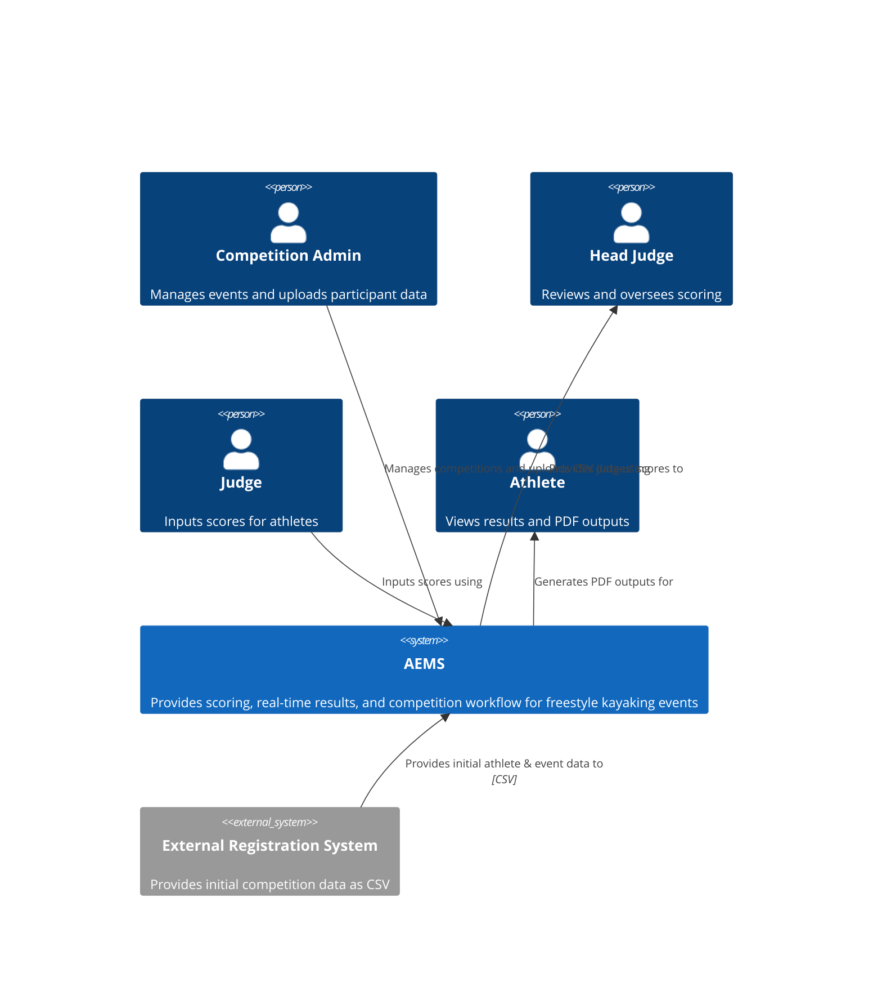
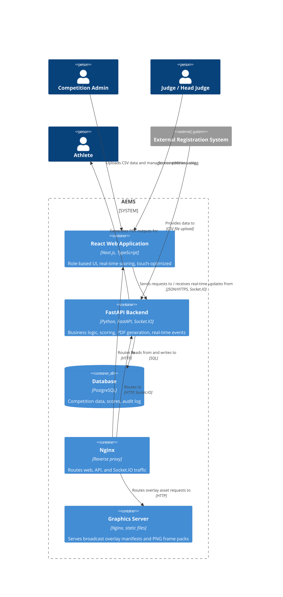
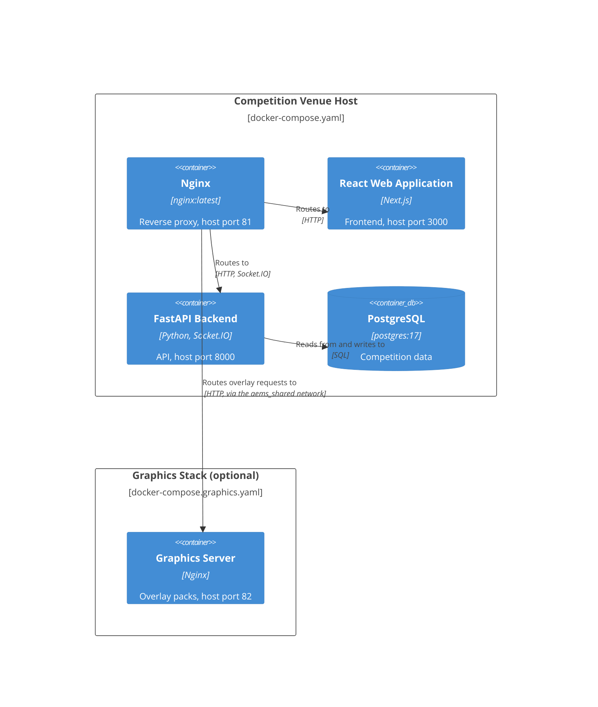

# AEMS Architecture Documentation

## Overview

AEMS (Athlete and Event Management System) follows the C4 model for architectural documentation, showing the system at multiple levels of abstraction.

## C4 Model

### What Is C4?

The C4 model describes software architecture at four levels:

1. **Context**: System scope and users
2. **Containers**: High-level technology choices
3. **Components**: Major system parts
4. **Code**: Implementation details

These diagrams cover the first two; component- and code-level detail lives in the source itself.

## System Views

### System Context

```mermaid
C4Context
    Person(admin, "Competition Admin", "Manages events and uploads participant data")
    Person(headJudge, "Head Judge", "Reviews and oversees scoring")
    Person(judge, "Judge", "Inputs scores for athletes")
    Person(athlete, "Athlete", "Views results and PDF outputs")

    System(aems, "AEMS", "Provides scoring, real-time results, and competition workflow for freestyle kayaking events")
    System_Ext(registration, "External Registration System", "Provides initial competition data as CSV")

    Rel(admin, aems, "Manages competitions and uploads CSV data using")
    Rel(judge, aems, "Inputs scores using")
    Rel(aems, headJudge, "Provides judges' scores to")
    Rel(aems, athlete, "Generates PDF outputs for")
    Rel(registration, aems, "Provides initial athlete & event data to", "CSV")

    UpdateLayoutConfig($c4ShapeInRow="3", $c4BoundaryInRow="1")
```

Key users and interactions:

- **Competition Admin**: Manages events and uploads participant data
- **Head Judge**: Reviews and oversees scoring
- **Judge**: Inputs scores for athletes
- **Athlete**: Views results and PDF outputs
- **External Registration System**: Provides initial competition data

### Container View

```mermaid
C4Container
    Person(admin, "Competition Admin")
    Person(judge, "Judge / Head Judge")
    Person(athlete, "Athlete")
    System_Ext(registration, "External Registration System")

    System_Boundary(aems, "AEMS") {
        Container(webApp, "React Web Application", "Next.js, TypeScript", "Role-based UI, real-time scoring, touch-optimized")
        Container(api, "FastAPI Backend", "Python, FastAPI, Socket.IO", "Business logic, scoring, PDF generation, real-time events")
        ContainerDb(database, "Database", "PostgreSQL", "Competition data, scores, audit log")
        Container(nginx, "Nginx", "Reverse proxy", "Routes web, API, and Socket.IO traffic")
        Container(graphicsServer, "Graphics Server", "Nginx, static files", "Serves broadcast overlay manifests and PNG frame packs")
    }

    Rel(admin, webApp, "Uploads CSV data and manages competitions using")
    Rel(judge, webApp, "Scores athletes using")
    Rel(nginx, webApp, "Routes to", "HTTP")
    Rel(nginx, api, "Routes to", "HTTP, Socket.IO")
    Rel(nginx, graphicsServer, "Routes overlay asset requests to", "HTTP")
    Rel(webApp, api, "Sends requests to / receives real-time updates from", "JSON/HTTPS, Socket.IO")
    Rel(api, database, "Reads from and writes to", "SQL")
    Rel(registration, api, "Provides data to", "CSV file upload")
    Rel(api, athlete, "Generates PDF outputs for")

    UpdateLayoutConfig($c4ShapeInRow="3", $c4BoundaryInRow="1")
```

Core components:

1. **React Web Application**

   - Single-page application
   - Role-based interfaces
   - Real-time scoring updates
   - Touch-optimized UI

2. **FastAPI Backend**

   - RESTful API endpoints
   - Socket.IO for real-time events
   - Business logic
   - PDF generation
   - CSV data import

3. **PostgreSQL Database**

   - Competition data
   - Scoring records
   - User sessions
   - Audit logs

4. **Nginx Reverse Proxy**

   - Request routing for the web app, API, and Socket.IO traffic
   - Static file serving
   - Proxies broadcast overlay requests to the Graphics Server

5. **Graphics Server**
   - Separate Nginx instance serving broadcast overlay "graphics packs"
   - Hosts per-component JSON manifests and PNG frame sequences
   - Kept separate from the main app so licensed graphics assets stay out of the open-source codebase (see ADR005)

## Data Flows

### Competition Setup Flow

1. Admin receives CSV from the external registration system
2. Uploads it through the web interface
3. The backend validates and processes the data
4. The competition structure is created in the database
5. Connected clients receive the new competition over Socket.IO

### Scoring Flow

1. Judge opens the scoring interface
2. Inputs scores through the touch interface
3. Socket.IO broadcasts the update in real time
4. The backend validates and stores the scores
5. Results are calculated
6. The head judge receives the live update
7. PDF outputs are generated for athletes

### Real-Time Updates

- Socket.IO connections for live scoring (see ADR006)
- Automatic reconnection with backoff, built into the Socket.IO client
- State synchronization across devices on reconnect

## Deployment Architecture

```mermaid
C4Deployment
    Deployment_Node(venue, "Competition Venue Host", "docker-compose.yaml") {
        Container(nginxDep, "Nginx", "nginx:latest", "Reverse proxy, host port 81")
        Container(webAppDep, "React Web Application", "Next.js", "Frontend, host port 3000")
        Container(apiDep, "FastAPI Backend", "Python, Socket.IO", "API, host port 8000")
        ContainerDb(dbDep, "PostgreSQL", "postgres:17", "Competition data")
    }
    Deployment_Node(graphics, "Graphics Stack (optional)", "docker-compose.graphics.yaml") {
        Container(graphicsDep, "Graphics Server", "Nginx", "Overlay packs, host port 82")
    }

    Rel(nginxDep, webAppDep, "Routes to", "HTTP")
    Rel(nginxDep, apiDep, "Routes to", "HTTP, Socket.IO")
    Rel(nginxDep, graphicsDep, "Routes overlay requests to", "HTTP, via the aems_shared network")
    Rel(apiDep, dbDep, "Reads from and writes to", "SQL")

    UpdateLayoutConfig($c4ShapeInRow="2", $c4BoundaryInRow="1")
```

The two stacks run as separate Docker Compose files and communicate over the external `aems_shared` Docker network (see [Running AEMS With the Graphics Server](../deployment/aems-with-graphics-server.md)). The graphics stack is optional: the main stack starts and serves the rest of the app even when it isn't running.

### Deployment Options

1. **Local Deployment**

   - Single machine setup
   - All containers on the local host
   - Suitable for small competitions

2. **Networked Deployment**
   - Central server running the containers
   - Tablets and display devices connect over WiFi
   - Network isolation for security
   - Requires router configuration

## Technical Decisions

> Architectural decisions are stored in [/decisions](../decisions/), starting with [ADR001: Record Architectural Decisions](../decisions/ADR001-record-architectural-decisions.md)

### Frontend Architecture

- React for component-based UI
- TypeScript for type safety
- Redux for state management
- RTK Query for API integration
- Material-UI for touch-friendly components

### Backend Architecture

- FastAPI for async performance
- SQLAlchemy for ORM
- Alembic for migrations
- Socket.IO for real-time updates (see ADR006)
- Structured logging

### Database Design

- PostgreSQL for reliability
- JSON fields for flexible schemas
- Transaction support for scoring
- Audit logging for changes

## Security Considerations

- Network isolation in production
- Rate limiting on API endpoints
- Input validation at all levels
- SQL injection prevention
- XSS protection

## Monitoring

- Structured JSON logging
- Error tracking
- Request correlation IDs

## Future Considerations

- Horizontal scaling support
- Backup and recovery procedures
- Caching layer implementation
- Mobile app integration

## Updating These Diagrams

These diagrams are plain Mermaid code blocks in this file — GitHub and most Markdown viewers render them natively, so there's no separate export step:

1. Edit the `C4Context`, `C4Container`, or `C4Deployment` block above.
2. Commit — the rendered diagram updates wherever this file is viewed.
