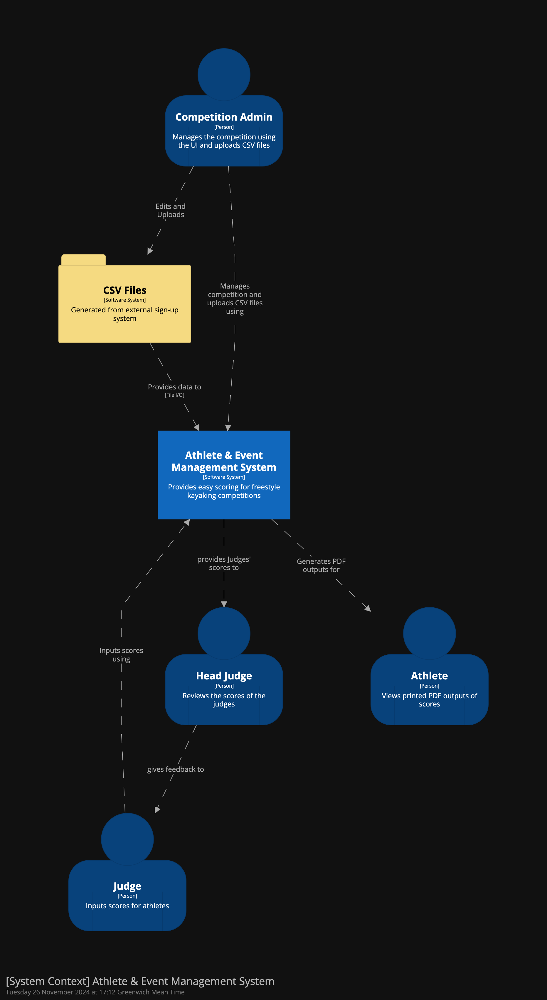
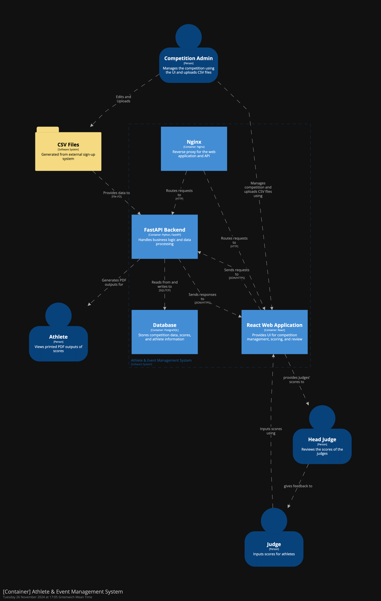

# AEMS Architecture Documentation

## Overview

The Athlete and Event Management System (AEMS) follows the C4 model for architectural documentation, providing multiple levels of abstraction to understand the system structure.

## C4 Model

### What is C4?

The C4 model is a layered approach to describing software architecture using four levels:

1. **Context**: System scope and users
2. **Containers**: High-level technology choices
3. **Components**: Major system parts
4. **Code**: Implementation details

## System Views

### System Context



Key users and interactions:

- **Competition Admin**: Manages events and uploads participant data
- **Head Judge**: Reviews and oversees scoring
- **Judge**: Inputs scores for athletes
- **Athlete**: Views results and PDF outputs
- **External Registration System**: Provides initial competition data

### Container View



Core components:

1. **React Web Application**

   - Single-page application
   - Role-based interfaces
   - Real-time scoring updates
   - Touch-optimized UI

2. **FastAPI Backend**

   - RESTful API endpoints
   - WebSocket connections
   - Business logic
   - PDF generation
   - CSV data import

3. **PostgreSQL Database**

   - Competition data
   - Scoring records
   - User sessions
   - Audit logs

4. **Nginx Reverse Proxy**
   - Request routing
   - Static file serving
   - SSL termination
   - Load balancing

## Data Flows

### Competition Setup Flow

1. Admin receives CSV from external system
2. Uploads via web interface
3. Backend validates and processes data
4. Competition structure created in database
5. UI updates with new competition

### Scoring Flow

1. Judge accesses scoring interface
2. Inputs scores via touch interface
3. Real-time updates via WebSocket
4. Backend validates and processes scores
5. Results calculated and stored
6. Head judge receives live updates
7. PDF outputs generated for athletes

### Real-time Updates

- WebSocket connections for live scoring
- Automatic reconnection handling
- Message queuing for offline operation
- State synchronization across devices

## Deployment Architecture

### Docker Containers

```
docker-compose.yaml
├── webapp          # React frontend
├── api            # FastAPI backend
├── postgres       # Database
└── nginx          # Reverse proxy
```

### Deployment Options

1. **Local Deployment**

   - Single machine setup
   - All containers on local host
   - Suitable for small competitions

2. **Networked Deployment**
   - Central server running containers
   - Tablets/devices connect via WiFi
   - Network isolation for security
   - Requires router configuration

## Technical Decisions

### Frontend Architecture

- React for component-based UI
- TypeScript for type safety
- Redux for state management
- RTK Query for API integration
- Material-UI for touch-friendly components

### Backend Architecture

- FastAPI for async performance
- SQLAlchemy for ORM
- Alembic for migrations
- WebSockets for real-time updates
- Structured logging

### Database Design

- PostgreSQL for reliability
- JSON fields for flexible schemas
- Transaction support for scoring
- Audit logging for changes

## Security Considerations

- Network isolation in production
- Rate limiting on API endpoints
- Input validation at all levels
- Secure WebSocket connections
- SQL injection prevention
- XSS protection

## Monitoring

- Structured JSON logging
- Error tracking
- Performance metrics
- Real-time system status
- Request correlation IDs

## Future Considerations

- Horizontal scaling support
- Backup and recovery procedures
- Caching layer implementation
- Mobile app integration
- Offline mode support

## Updating These Diagrams

The C4 diagrams are generated using Structurizr DSL:

1. Edit `c4_diagram.dsl`
2. Generate diagrams:

   ```bash
   docker pull structurizr/lite
   docker run -it --rm -p 8080:8080 -v $PWD:/usr/local/structurizr structurizr/lite
   ```

   Or use [Structurizr Online](https://structurizr.com/dsl)

3. Export PNG files:
   - System Context: structurizr-SystemContext.png
   - Containers: structurizr-Containers.png
   - Deployment: structurizr-Deployment.png
