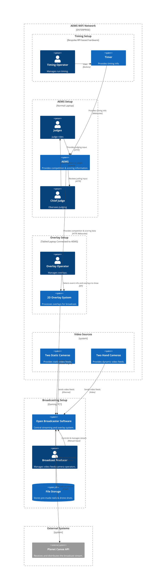

# Broadcast Architecture

This document outlines the high level architecture for a potential broadcast system built upon the AEMS Scoring System

```mermaid
C4Context

Enterprise_Boundary(b0, "AEMS WiFi Network") {

    Boundary(Timing, "Timing Setup", "Bespoke RPI based hardware") {
    Person(TimingOperator, "Timing Operator", "Manages run timing.")
    System(TimingBox, "Timer", "Provides timing info")

    }
        Boundary(AEMSSystem, "AEMS Setup", "Normal Laptop") {
    Person(Judges, "Judges", "Judge rides")
    System(AEMS, "AEMS", "Provides competition & scoring information.")

        Person(ChiefJudge, "Chief Judge", "Obersees Judging")

    }
    Boundary(OverlaySystem, "Overlay Setup", "Tablet/Laptop Connected to AEMS") {
        Person(OverlayOperator, "Overlay Operator", "Manages overlays.")
    System(OverlaySystem, "2D Overlay System", "Processes overlays for broadcast.")
}

        Boundary(VideoSources, "Video Sources") {
        System(StaticCameras, "Two Static Cameras", "Provides static video feeds.")
        System(HandCameras, "Two Hand Cameras", "Provides dynamic video feeds.")
    }
}
    Boundary(BroadcastSystem, "Broadcasting Setup", "Gaming PC?") {
        System(OBS, "Open Broadcaster Software", "Central streaming and overlay system.")

        Person(Producer, "Broadcast Producer", "Manages video feeds camera operators.")
                SystemDb(FileSystem, "File Storage", "Stores pre-made reels & drone shots.")

    }


    Rel(Judges, AEMS,  "Provides judging input", "HTTP")
    Rel(AEMS, ChiefJudge, "Reviews Juding Input", "HTTP")
    Rel(ChiefJudge, Judges, "gives feedback to judges", "Speech")
    Boundary(External Systems, "External Systems") {
    System_Ext(PlanetCanoeAPI, "Planet Canoe API", "Receives and distributes the broadcast stream.")
    }
    Rel(Producer, OBS, "Controls & manages stream", "Manual Input")
    Rel(OBS, PlanetCanoeAPI, "Broadcast stream", "RTMP")
    Rel(AEMS, OverlaySystem, "Provides competition & scoring data", "HTTP, Websocket")
    Rel(OverlayOperator, OverlaySystem, "Selects event info and overlays to show", "API")
    Rel(TimingOperator, TimingBox, "Uses", "Buttons")
    Rel(TimingBox, AEMS,  "Provides timing info", "Weboscket")
    Rel(OverlaySystem, OBS, "Provides overlays", "Render Engine")
    Rel(StaticCameras, OBS, "Sends video feeds", "Ethernet")
    Rel(HandCameras, OBS, "Sends video feeds", "Video")
    Rel(FileSystem, OBS, "Provides stored media", "Local File Access")

     UpdateLayoutConfig($c4ShapeInRow="3", $c4BoundaryInRow="1")
```
