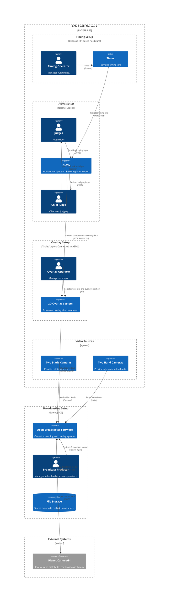

# Broadcast Architecture

> **Superseded.** This document sketched a potential OBS/RTMP broadcast pipeline. What was actually built is a Pixi.js/WebGL overlay rendered inside the AEMS web app itself, with a separate Nginx server hosting the graphics packs — see [ADR005](../decisions/ADR005-use-webgl-and-nginx-for-overlays.md) and [ADR007](../decisions/ADR007-use-pixi-react-frame-sequence-wrapper-for-overlay-composition.md). Kept here for historical context.

This document outlines the high level architecture for a potential broadcast system built upon the AEMS Scoring System

