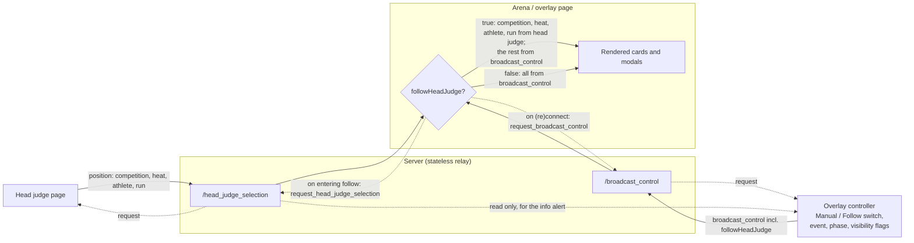

# Design

## Context

- The head judge screen (`roles/headJudge/headJudge.tsx`) keeps its competition, event, phase, heat, paddler index, and run in local Redux. It already resolves the current athlete to an `AthleteInfo` (`selectedAthlete`). Its only outbound real-time traffic is `run_status`.
- The overlay controller (`broadcast/controller.tsx`) builds an `OverlayControlState` from its own Redux selection and emits it on `/broadcast_control` every time it changes.
- The arena (`arena/arena.tsx`) and overlay (`broadcast/overlay.tsx`) pages each:
  - read one `overlayControlState` from `useBroadcastControlStreamQuery()`;
  - push its selection into local Redux through `useSyncOverlaySelectionState`, which the cards read;
  - pass it to the modals.
  A page that reloads starts from `defaultOverlayControllerState`.
- A heat belongs to a competition, not to a phase or event: `Heat` has only `competition_id`, and athletes are tied to a phase per athlete through `AthleteHeat`. So the head judge's event and phase selections say nothing about who is on the water.
- The server ([broadcastEndpoints.py](../../../Server/app/broadcastEndpoints.py)) is a stateless relay. Production runs several gunicorn workers joined by the Redis Socket.IO client manager, so per-process memory cannot hold "latest state".

See proposal.md for motivation.

## Data flow



## Goals / Non-Goals

**Goals:**
- Display pages choose the source of the competition, heat, athlete, and run; the controller never relays the head judge's position.
- The server stays stateless.

**Non-Goals:**
- Persisting the controller's mode across a reload of the controller tab. The mode resets to Manual (see Risks).
- Coordinating several open controllers or several open head judge screens. That is already unsupported for controllers today.

## Decisions

### 1. Display pages switch source; the controller only sets the flag
The controller adds `followHeadJudge: boolean` to `OverlayControlState`, defaulting to false. A new hook, `useDisplayedOverlayState()`, replaces the `useBroadcastControlStreamQuery()` call in `arena.tsx` and `overlay.tsx`. It returns `overlayControlState` unchanged when not following. When following and a head judge position has arrived, it returns `overlayControlState` with `selectedCompetition`, `selectedHeat`, `selectedAthlete`, and `selectedRun` replaced by the position's values. Both pages pass that result to `useSyncOverlaySelectionState` and the modals exactly as they do now, so no card changes.

**Alternatives considered:**
- **The controller copies the head judge's position into its own pickers and keeps emitting.** This was rejected at the user's request. The data flow should not depend on the controller's picker state, and the displays should follow the head judge even while the controller sits idle.
- **The head judge writes `broadcast_control` directly.** This was rejected. Two writers each send the full state, so each would overwrite the other's fields with stale values.

### 2. The head judge publishes `{ competition, heat, athlete, run }`
```ts
export interface HeadJudgePosition {
	competitionId: string
	heatId: string
	athlete: AthleteInfo
	runNumber: number
}
```
- The athlete is sent as the full `AthleteInfo` the head judge already holds, because the display cards render the name, bib, and affiliation from `selectedAthlete`. Sending only an id would make every display look the athlete up again.
- Event and phase are omitted (see Context).
- A later scribe indicator can compare its own heat, athlete id, and run against this.

### 3. A new `/head_judge_selection` namespace with a request/answer pair
The namespace carries two events:
- `head_judge_selection` carries a `HeadJudgePosition` and is relayed to all clients, including the sender, like `broadcast_control`.
- `request_head_judge_selection` has no payload and is relayed to all other clients (`skip_sid`). The head judge screen answers it by publishing its position again.

On `/broadcast_control`, `request_broadcast_control` has no payload and is relayed with `skip_sid`. The controller answers it by emitting its current state. A display that reloads needs this to learn `followHeadJudge` at all.

**Alternatives considered:**
- **Cache the last message on the server.** This was rejected. With several workers it needs Redis-backed state for a problem the request/answer pair solves without any.
- **Periodic re-emission (a heartbeat).** This was rejected. It sends traffic constantly, while the request/answer pair sends only when someone connects.

### 4. Streams and request counters in `streamingApi`
The sockets live inside `streamingApi` query lifecycles, so components cannot attach listeners directly.
- `broadcastControlStream` emits `request_broadcast_control` in its socket's `connect` handler. The `connect` event fires again on every reconnect, which gives recovery after a reconnect for free.
- New queries:
  - `headJudgePositionStream`: the latest `HeadJudgePosition` or `undefined`. On connect it emits `request_head_judge_selection`.
  - `broadcastControlRequestStream` and `headJudgeSelectionRequestStream`: a number incremented on each incoming request.
- The emitting component lists the counter in its emit effect's dependencies, so it re-emits when asked.
- A new `emitHeadJudgePosition` mutation uses the existing `emitWithSocketReuse` helper. It reuses the socket that `headJudgeSelectionRequestStream` registers, because the head judge screen subscribes to that stream in order to answer requests.
- `useDisplayedOverlayState` and the controller subscribe to `headJudgePositionStream` with `skip: !followHeadJudge`, so the socket and its request exist only while following. Re-entering follow re-runs the request.

### 5. The head judge builds its position from existing state
`headJudge.tsx` already holds `selectedCompetition`, `selectedHeat`, `selectedAthlete`, and `selectedRun`. It builds a `HeadJudgePosition` in a `useMemo` and emits it in an effect keyed on that value and on the request counter. Nothing is emitted until a heat and athlete are selected.

### 6. Controller UI
- A two-option MUI `ToggleButtonGroup` ("Manual" / "Follow head judge") sits above the pickers. It toggles `followHeadJudge` in the controller's state, which then emits as usual.
- The competition, heat, paddler, and run pickers are wrapped in a container with the native `inert` attribute (a boolean prop in React 19) and reduced opacity while following. `inert` blocks pointer and keyboard interaction and removes the contents from the accessibility tree.
  - `SelectorDisplay` already takes per-picker `show*` flags, so the controller renders one `SelectorDisplay` with event and phase outside the container, and one with competition and heat inside it, alongside `PaddlerSelector` and `RunSelector`.
- An MUI `Alert` (`severity="info"`) above the container says the pickers are disabled because the displays are following the head judge. It names the head judge's current athlete and run from `headJudgePositionStream`, or says "Waiting for head judge" until the first position arrives. This is the controller's only use of the position, and it is read-only.
- The heat-summary prerequisite check uses the followed heat while following, and the controller's own heat otherwise. The event and phase checks are unchanged.

**Alternative: a `disabled` prop threaded through each picker.** This was rejected. None of the pickers accepts one today, and they are shared with the judging screens.

## Risks / Trade-offs

- **[Disabled pickers show the controller's own, now-ignored values] → the operator could misread them as what's on screen.** The info alert names the head judge's athlete and run right above them. If this still confuses operators, hide the followed pickers instead of disabling them.
- **[Controller tab reloads] → mode resets to Manual.** Its next emission turns following off on every display. This is acceptable for an attended tab. If it bites in practice, add a `localStorage` preference.
- **[Display reloads with no controller open] → it falls back to the default state, not Follow.** This is covered by the proposal's non-goal: a controller must be open.
- **[Head judge closes their screen] → displays keep the last received position.** This is preferable to blanking the arena mid-heat.
- **[Two head judge screens open] → both publish, and the last one wins.** This is the same as two controllers today. It is out of scope.
- **[Request storm on server restart] → every display reconnects and requests at once.** The controller and head judge each answer with one small emit per request. The number of displays at a venue is in single digits.

## Migration Plan

Frontend and backend deploy together as usual. A `broadcast_control` message without `followHeadJudge` reads as false (Manual), so mixed versions degrade to today's behaviour. No rollback steps are needed.
